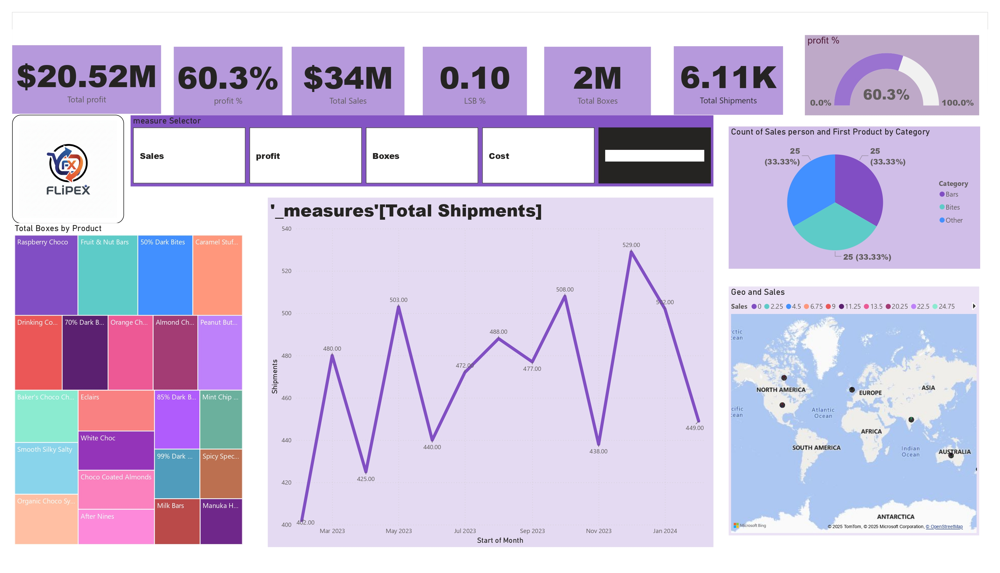

<h1 align="center">📊 Regional Sales Analysis Dashboard</h1>

<p align="center">
  
  
  
  
</p>

---

## 🧭 Project Summary

This project presents a **comprehensive regional sales performance analysis** using **Power BI** for visualization and **Python (Pandas)** for data cleaning and preprocessing.  
The goal is to uncover insights about **regional performance, customer behavior, and product profitability** from a multi-sheet sales dataset.

---

## 🧩 Project Overview

This analysis integrates data from multiple sources — including **Sales Orders**, **Customers**, **Products**, **Regions**, and **Budgets** — into a unified analytical model.

- 🧹 **Data Cleaning:** Performed in Python using `pandas` and `numpy`  
- 📊 **Visualization:** Designed in Power BI with interactive dashboards  
- 💡 **Insights:** Top-performing regions, revenue growth, and product trends

---

## ⚙️ Tech Stack

| Tool | Purpose |
|------|----------|
| 🐍 **Python (Pandas, NumPy)** | Data Cleaning and Transformation |
| 📊 **Power BI** | Interactive Visualization and Dashboard |
| 📗 **Excel** | Source Dataset |
| 📈 **Matplotlib / Seaborn** | Exploratory Data Analysis |

---

## 🧹 Data Cleaning Steps

**Script:** [`Data_cleaning.py`](Data_cleaning/Data_cleaning.py)

**Main Operations:**
1. Loaded multiple Excel sheets with `pandas.read_excel()`  
2. Merged datasets — `Sales Orders`, `Customers`, `Products`, `Regions`, and `Budgets`  
3. Removed duplicate or redundant columns (`_x`, `_y`)  
4. Standardized column names and formatting  
5. Dropped unnecessary attributes for better clarity  
6. Exported final dataset as `data.csv` for Power BI

**Example Code:**
```python
df = df.merge(df_customers, how='left', left_on='Customer Name Index', right_on='Customer Index')
df = df.merge(df_products, how='left', left_on='Product Description Index', right_on='Index')
df = df.drop(columns=[col for col in df.columns if col.endswith('_y')])
df = df.rename(columns=lambda x: x[:-2] if x.endswith('_x') else x)
```
📈 Power BI Dashboard
The final Power BI report Sales_analytics.pbix includes:

🌍 Regional Sales Breakdown

💰 Revenue vs Budget Performance

👥 Top Customers & Products

🗺️ Geographical Sales Heat Map

📦 Channel-wise Comparison

| Overview                                    | 
| ------------------------------------------- | 
|  | 


🚀 How to Run
1️⃣ Clean the Data
```python
python Data_cleaning.py
```
2️⃣ Open Power BI Report

Launch Power BI Desktop

Open Sales_analytics.pbix

Verify that the cleaned data.csv is correctly linked as a data source

💡 Insights Derived

The North-East region contributed the highest sales volume.

Product Bundles showed 15–20% higher profit margins.

Seasonal patterns indicated spikes during Q2 and Q4.

Customer loyalty was stronger in regions with multi-channel availability.

🏆 Key Learnings

Efficient handling of messy multi-sheet Excel data using Pandas merge operations.

Designing intuitive and interactive dashboards using Power BI visuals.

Integrating Python preprocessing with Power BI workflows for scalable reporting.

📧 Contact

Author: Abhilasha Jha
Email: abhilashajha052@gmail.com
LinkedIn: https://www.linkedin.com/in/abhilasha-jha-a54971276/

